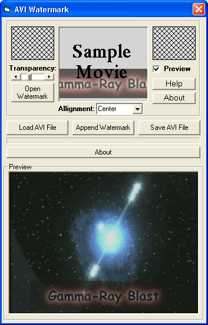

<div align="center">

## Add watermark to AVI\!


</div>

### Description

Now you can leave your mark on your favorite AVI movie! With AVI Watermark you just load the image, choose the AVI movie, and let the windows AVI apis do the rest! You can even decide where the watermark is placed on your AVI and the transparency! You can also choose the compression method (divx, cinemax, etc) to save the AVI in! Original code, nothing like this on planetsourcecode. I worked a long time on this writing it (mostly) from scratch. Look at the screenshot to see what this program can do! I'm sure you'll find this useful! Oh and please vote for me. I worked hard building this program from the ground up. I don't care if you do or not I made the program to help people out and when people vote I know i accomplished that :)
 
### More Info
 


<span>             |<span>
---                |---
**Submitted On**   |2003-03-01 20:14:38
**By**             |[PyroKid4u2](https://github.com/Planet-Source-Code/PSCIndex/blob/master/ByAuthor/pyrokid4u2.md)
**Level**          |Advanced
**User Rating**    |5.0 (99 globes from 20 users)
**Compatibility**  |VB 4\.0 \(16\-bit\), VB 4\.0 \(32\-bit\), VB 5\.0, VB 6\.0
**Category**       |[Graphics](https://github.com/Planet-Source-Code/PSCIndex/blob/master/ByCategory/graphics__1-46.md)
**World**          |[Visual Basic](https://github.com/Planet-Source-Code/PSCIndex/blob/master/ByWorld/visual-basic.md)
**Archive File**   |[Add\_waterm155310322003\.zip](https://github.com/Planet-Source-Code/pyrokid4u2-add-watermark-to-avi__1-43664/archive/master.zip)

### API Declarations

```
Quite a few, actually :)
Only the windows avi apis, no mci apis.
```


